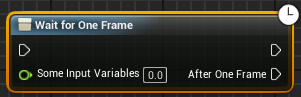

[Home](../README.md) > [General Knowledge](README.md) > [Native Programming](Native%20Programming.md)
# Native Programming
General usages in c++ programming.

## Macros & Functions
- `FORCEINLINE` : Reduces function call overhead. FORCEINLINE has a stronger influence on the compiler than `inline`. Use in small, performance-critical functions. `FORCEINLINE_DEBUGGABLE` to allow debugging in Development builds. `FORCENOINLINE` to force no inline when to limit memory to the function scope. inline is safer and more predictable than #define macro functions.
- `PURE_VIRTUAL` : Defines a pure virtual function but ensures it causes a compile-time error if unimplemented while `virtual = 0` is a later linker error.
- `UPROPERTY(Transient)` : Prevents serialization of a variable (avoids unnecessary memory usage). Avoid adding unnecessary UPROPERTY reflection if you don’t need garbage collection or blueprint exposure.
- `LIKELY(x)` / `UNLIKELY(x)` : Hints branch prediction for the CPU, improving instruction flow for if/else conditions.
- `UE_PREFETCH(x)` : Preloads memory locations into cache, reducing cache misses.
- `ensure(x)` logs a warning & execution continues (slower than check). `check(x)` crashes in Debug & Development builds and is removed in Shipping builds unless config is changed. `UE_ASSUME(x)` optimizes out code that would handle the failure.
- `MoveTemp(array)` : Moves ownership of an array without copying it.

## Events
Use static delegates for better performance. Use dynamic delegates for flexibility and blueprint usages.
- `DECLARE_DELEGATE_OneParam` : C++ only event accepting only 1 listener.
  - `DECLARE_DELEGATE_RetVal_TwoParams` : Non-multicast c++ event can return a value.
  - Add listener with BindUObject function. Returns a delegate handle that you need to store in order to remove it later.

- `DECLARE_DYNAMIC_DELEGATE_OneParam` : C++ and blueprint event accepting only 1 listener. Slightly less performant than non-dynamic.
   - DECLARE_DYNAMIC_DELEGATE_RetVal_TwoParams : With return value.
   - Add listener with BindDynamic function. No need to store any delegate handle.

- `DECLARE_MULTICAST_DELEGATE_OneParam` : C++ event accepting multiple listeners.
   - Add listener with AddUObject, AddRaw for non-uobject and AddLambda for anonymous function. Returns a delegate handle that you need to store in order to remove it later.

- `DECLARE_DYNAMIC_MULTICAST_DELEGATE_OneParam` : C++ and blueprint event accepting multiple listeners. Slightly less performant than non-dynamic.
   - Add listener with AddDynamic or AddUniqueDynamic function. No need to store any delegate handle.
   - Add UPROPERTY(BlueprintAssignable) on this delegate property within the class UAbilityTask to expose output pins in blueprint :


## Interfaces
### Native Interface
Not usable nor callable in blueprint

<table>
<tr>
<th> Interface declaration </th>
<th> Implementing the interface </th>
</tr>
<tr>
<td>

```c++
#pragma once

#include "CoreMinimal.h"

#include "UObject/Interface.h"
#include "MyClassInterface.generated.h"

UINTERFACE(MinimalAPI)
class UMyClassInterface : public UInterface
{
  GENERATED_BODY()
};

class MY_API IMyClassInterface
{
  GENERATED_BODY()
public:
  virtual void MyFunction(const FString& Message) = 0;
};
```
</td>
<td>

```c++
#pragma once

#include "MyClassInterface.h"
#include "MyClassOverride.generated.h"

UCLASS()
class MY_API UMyClassOverride : public UObject, public IMyClassInterface
{
  GENERATED_BODY()
public:
  virtual void MyFunction(const FString& Message) override;
};


```
</td>
</tr>
</table>
 Using the interface :

``` c++
UPROPERTY()
TScriptInterface<IMyClassInterface> MyClass;

MyClass = NewObject<UMyClassOverride>();

Listener->MyFunction(TEXT("My Message"));
```

### Blueprint Interface
Usable and callable in blueprint. Much less performant than c++ interfaces.


<table>
<tr>
<th> Interface declaration </th>
<th> Implementing the interface </th>
</tr>
<tr>
<td>

```c++
#pragma once

#include "CoreMinimal.h"
#include "UObject/Interface.h"
#include "MyClassInterface.generated.h"

UINTERFACE(MinimalAPI, Blueprintable)
class UMyClassInterface : public UInterface
{
  GENERATED_BODY()
};

class MY_API IMyClassInterface
{
  GENERATED_BODY()
public: 
  UFUNCTION(BlueprintNativeEvent, BlueprintCallable, Category = MyCategory)
  void MyFunction(const FString& Message);
};
```
</td>
<td>

```c++
#pragma once

#include "MyClassInterface.h"
#include "MyClassOverride.generated.h"


UCLASS(Blueprintable)
class MY_API UMyClassOverride : public UObject, public IMyClassInterface
{
  GENERATED_BODY()

public:
  virtual void MyFunction_Implementation(const FString& Message) override;
};
```
</td>
</tr>
</table>

 Using the interface :

```c++
UPROPERTY(BlueprintReadOnly)
TScriptInterface<IMyClassInterface> MyClass;

MyClass = NewObject<UMyClassOverride>();

IMyClassInterface::Execute_MyFunction(MyClass.GetObjectRef(), TEXT("My Message"));
```

## Blueprint Helpers
### UBlueprintFunctionLibrary
Blueprint accessible function within a UBlueprintFunctionLibrary are available from any blueprint context.

```c++
UCLASS()
class UYourFunctionLibrary : public UBlueprintFunctionLibrary
{
	GENERATED_BODY()
	
	UFUNCTION(BlueprintCallable, Category="YourCategory")
	static bool DoSomething(FString Name, bool Enable = false);
};
```

### UBlueprintAsyncActionBase
Create latent/asynchronous nodes for easy blueprint usage. This class automatically add output pins for BlueprintAssignable dynamic delegates.

<table>
<tr>
<th> Interface declaration </th>
<th> Implementing the interface </th>
</tr>
<tr>
<td>

```c++
#pragma once
#include "Kismet/BlueprintAsyncActionBase.h"
#include "DelayOneFrame.generated.h"

DECLARE_DYNAMIC_MULTICAST_DELEGATE(FDelayOneFrameOutputPin);

UCLASS()
class YOUR_API UDelayOneFrame : public UBlueprintAsyncActionBase
{
	GENERATED_BODY()
public:
	UPROPERTY(BlueprintAssignable)
	FDelayOneFrameOutputPin AfterOneFrame;

    UFUNCTION(BlueprintCallable, meta = (BlueprintInternalUseOnly = "true", WorldContext = "WorldContextObject"), Category = "Flow Control")
	static UDelayOneFrame* WaitForOneFrame(const UObject* WorldContextObject, const float SomeInputVariables);

    // UBlueprintAsyncActionBase interface
	virtual void Activate() override;
	//~UBlueprintAsyncActionBase interface
private:
	UFUNCTION()
	void ExecuteAfterOneFrame();
	
	UObject* WorldContextObject;
	float MyFloatInput;
};
```
</td>
<td>

```c++
UDelayOneFrame::UDelayOneFrame(const FObjectInitializer& ObjectInitializer) : Super(ObjectInitializer), WorldContextObject(nullptr), MyFloatInput(0.0f)
{
}

UDelayOneFrame* UDelayOneFrame::WaitForOneFrame(const UObject* WorldContextObject, const float SomeInputVariables)
{
	UDelayOneFrame* BlueprintNode = NewObject<UDelayOneFrame>();
	BlueprintNode->WorldContextObject = WorldContextObject;
	BlueprintNode->MyFloatInput = SomeInputVariables;
	return BlueprintNode;
}
void UDelayOneFrame::Activate()
{
	WorldContextObject->GetWorld()->GetTimerManager().SetTimerForNextTick(this, &UDelayOneFrame::ExecuteAfterOneFrame);
}

void UDelayOneFrame::ExecuteAfterOneFrame()
{
	AfterOneFrame.Broadcast();
}
```
</td>
</tr>
</table>




### ExpandEnumAsExecs
Adds multiple output pin when calling this function in blueprint. The output exec will run based on "Branches" in this code below. This practice can force designers to use safe code by combining a getter and IsValid nodes into one function call.

```c++
UENUM(BlueprintType)
enum class EMUnsafeExec : uint8
{
    Success,
    Failure
};

UFUNCTION(BlueprintCallable, Category = "YourCategory", Meta = (WorldContext = "WorldContextObject", ExpandEnumAsExecs = "Branches"))
static UClass* GetUnsafeClass(UObject* WorldContextObject, EMUnsafeExec& Branches);
```
## Static Polymorphism
Using templates to have polymorphism. Better CPU performance because it has no vtable lookup, function calls are inline and it's CPU cache-friendly. The downsides are that it's less flexible without override and it's difficult to debug.
```c++
template <typename Derived>
class TAbilityBase
{
public:
    void Execute() 
    {
        static_cast<Derived*>(this)->Implementation();
    }
};

class UMyAbility : public UObject, public TAbilityBase<UMyAbility>
{
public:
    void Implementation()
    {
        UE_LOG(LogTemp, Log, TEXT("Executing My Ability!"));
    }
};

void UseAbility()
{
    UMyAbility MyAbility;
    MyAbility.Execute(); // Calls UMyAbility::Implementation() without virtual function overhead
}
```

## Logic techniques
**TArray::ForEach** : Using ForEach can be more optimized than traditional 'for loops' as it replaces temporary copies by having lambda calls. The compiler can optimize lambda into inline executions which reduces overhead. Compare with real world timing to be sure to use the correct version.
```c++
MyArray.ForEach([&](const Type& Element) {
});
```

## Debugging
**PIE client watch value** to know which client triggered the breakpoint : {,,UE4Editor-Engine.dll}::GPlayInEditorContextString

© Samuel Daigle – Licensed under [CC BY-NC 4.0](https://creativecommons.org/licenses/by-nc/4.0/). 