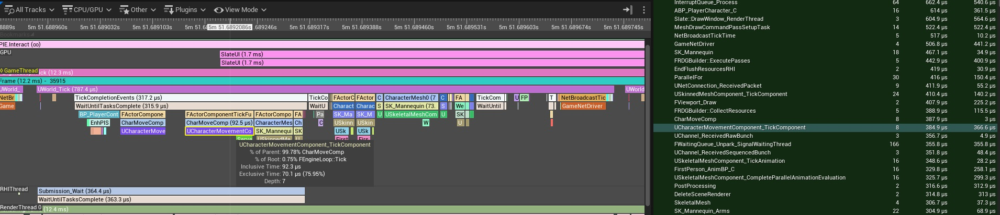

[Home](../README.md) > [Optimization](README.md) > [Profiling](Profiling.md)
# Profiling
### General process
Identify the bottleneck by using the command `stat unit` to see the highest time and look for solutions in [CPU Profiling](#cpu-profiling), [Draw (CPU render time)](#gpu-profiling) and [GPU (GPU render time)](#gpu-profiling). 

### Deciding the optimization budget
Before optimizing blindly, you must know the target hardware you plan to release to, then try to use as much of its available resource that you need without exceeding it.

Steps to decide the hardware budget :
1. Decide the minimum requirements for CPU, Memory and GPU budgets.
2. Establish a polygon count ratio (more detailed environment vs player model vs items)

## Game (CPU Game Thread) Profiling
The best tool to optimize CPU logic is  [UnrealInsights](https://dev.epicgames.com/documentation/en-us/unreal-engine/unreal-insights-in-unreal-engine). It allows to  Visualize executed Trace event functions in each tick to which function needs to be optimized. In UE5, click on the "Trace..." button at the bottom right of the editor or compile the program included with UnrealEngine's source code then open the executable. Use with Test packaged builds for better results.

You should use UnrealInsights to detect a lot of performance bottleneck information. As a general advice, you should filter the tracks to only the one you need, so if the Game bottleneck scope is the one you want to optimize, then you should filter to only see the GameThread track. Select the frame where hitches happen in the upper section, then look for the functions that took the highest portion of the selected Tick in the middle section.

Turn off v-sync to reduce noise when profiling (r.vsync 0), turn off framerate smoothing in project settings framerate group, use Test build (not development). Don't profile in-editor.

Use custom Traces to profile sensitive algorithms :
- `TRACE_CPUPROFILER_EVENT_SCOPE(MyFunction);`
- `TRACE_CPUPROFILER_EVENT_SCOPE_TEXT(*FString::Printf(TEXT("Scope %d"), SomeValue));`
- `TRACE_BOOKMARK(TEXT("Game event triggered"));`
- `TRACE_CPUPROFILER_EVENT_SCOPE_ON_CHANNEL(MyScope, MyCustomChannel);`
- `SCOPE_CYCLE_COUNTER(STAT_MyFunctionCount);`

## Draw (CPU Render Thread) Profiling
Use `stat SceneRendering` to view which step is using the most processing time.

Just list [Game (CPU) Profiling](#game-cpu-profiling), use UnrealInsights to profile Draw by looking at the Render Thread.

## GPU Time (GPU) Profiling

Quick investigation methods :
- Use `showFlag.<assetType> 0-1` to toggle the rendering of staticmesh, skeletal mesh, particles, lighting, translucency, reflectionenvironment, intancedfoliage, etc. This allows to quickly identify which part affects GPU performance the most.
- If frames get faster with `r.ScreenPercentage`  below 100, then you are GPU bound, otherwise it’s CPU bound.

### ProfileGPU
You can use the command `ProfileGPU` to view render frames and the time required for each rendering step. You can select the highest duration step and look for any optimizations from there.

### RenderDoc
For more advanced GPU profiling tools, you can use any third party tools that you trust, like [NVIDIA Performance Analysis Tools](https://developer.nvidia.com/performance-analysis-tools), [AMD Radeon GPU Profiler](https://gpuopen.com/rgp/) and [RenderDoc](https://renderdoc.org/).

### View Modes
View modes can be very useful when optimizing a game as it allows to visually identify areas with performance issues.

| Viewmode | Investigation |
| :------- | :------------ |
| `viewmode wireframe` | Shows polygon edges, useful for detecting high poly count |
| `viewmode lightcomplexity` | Identify areas with expensive lighting. Also view other menu options like Stationary Light Overlap and Lightmap Density. |
| `viewmode shadercomplexity` | Identify materials with high amounts of instructions to spot expensive shaders. |
| `viewmode LODColoration` | Display LODs to make sure they are property set up in each actor. |
| Opacity and Translucency menus | Identify materials connected to the opacity output or that are translucent, which can be very expensive on the GPU. |

While view modes help to quickly identify areas to improve, profiling is often a better option overall to have better before and after comparisons, get more precise data and focus on worse performing features in priority. For more information on each view mode, you can visit https://dev.epicgames.com/documentation/en-us/unreal-engine/viewport-modes-in-unreal-engine.

## Memory Profiling
Use `MemReport` to export a .memreport file in Project/Saved/Profiling.

MemReport has multiple categories including :
- **Memory Stats** : General memory stats to know current limits and usages.
- **Object List** (Begin command "obj list -resourcesizesort" with optional class parameter) : Generally the most important list to look at, starting from biggest offenders.
- **Texture Memory Stats** (Begin command "listtextures nonvt") : Look for uncompressed, non-power-of-two textures and overly large textures.
- **Spawned Actors** (Begin command "ListSpawnedActors") : Looking if some actor are taking too much memory.

Other tools :
- **UnrealInsights** for live memory allocation tracking, garbage collecting and asset loading times. Alternatively, you can use Session Frontend for non-exhaustive checks.
- **Size Map** for visualizing the size of asset dependencies.
- **Reference Viewer** : Tracking asset references

© Samuel Daigle – Licensed under [CC BY-NC 4.0](https://creativecommons.org/licenses/by-nc/4.0/).  