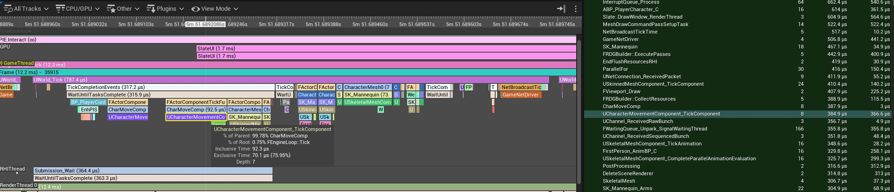

[Home](../README.md) > [Optimization](README.md)  
Related Pages : [Multithreading](Multithreading.md) • [Slate Optimization](Slate%20Optimization.md) • [Native Programming](../General%20Knowledge/Native%20Programming.md)
# Optimization
Optimization practices to develop high-FPS experiences or to run on lower end hardware.

### Sections
- [Multithreading](Multithreading.md)
- [Slate Optimization](Slate%20Optimization.md)

### Good Practices to adopt in the Early Stage of development
Most optimization should be done after you have a playable demo and some extreme optimizations can be done a few months before releasing the game. In general, you should focus on making the game first, but keep some good practices during development to reduce optimization efforts near the release.

Good practices include :
- 3D models :
  - Importing lower poly models : Some models found on the internet have a poly count way too high to be used in games. When you download models, be sure to reduce their poly count in a 3d modeling software before importing in the editor.
  - Generate LODs by selecting the LOG Group under LOD Settings of the static mesh.
  - Enable Nanite and static mesh's Nanite Support for high-poly meshes to reduce polys based on distance automatically. Keep Nanite disabled for mobile and VR games, as it is less optimized than doing it manually.
- Blueprint/C++ :
  - Store referenced assets in properties as FSoftObjectPath, TSoftObjectPtr or as class to prevent loading all of these in memory at once. Use the blueprint's `AsyncLoadAsset` node, `UKismetSystemLibrary::LoadAsset` or `UGameGlobals::Get().StreamableManager.RequestAsyncLoad` to load soft objects async.
  - Add `TRACE_CPUPROFILER_EVENT_SCOPE` or `SCOPE_CYCLE_COUNTER` on scopes you wish to profile.

### Deciding the optimization budget
Before optimizing blindly, you must know the target hardware you plan to release to, then try to use as much of its available resource that you need without exceeding it.

Steps to decide the hardware budget :
1. Decide the minimum requirements for CPU, Memory and GPU budgets.
2. Establish a polygon count ratio (more detailed environment vs player model vs items)

## Deciding what to optimize
### General process
Identify the bottleneck by using the command `stat unit` to see the highest time and look for solutions in [Game (C++ / Blueprint)](#optimizing-game-c--blueprint), [Draw (CPU render time)](#optimizing-draw-cpu-render-time) and [GPU (GPU render time)](#optimizing-game-gpu-gpu-render-time). 

#### Optimizing Game (C++ / Blueprint)
The best tool to optimize CPU logic is  [UnrealInsights](https://dev.epicgames.com/documentation/en-us/unreal-engine/unreal-insights-in-unreal-engine). It allows to  Visualize executed Trace event functions in each tick to which function needs to be optimized. In UE5, click on the "Trace..." button at the bottom right of the editor or compile the program included with UnrealEngine's source code then open the executable. Use with Test packaged builds for better results.

You should use UnrealInsights to detect a lot of performance bottleneck information. As a general advice, you should filter the tracks to only the one you need, so if the Game bottleneck scope is the one you want to optimize, then you should filter to only see the GameThread track. Select the frame where hitches happen in the upper section, then look for the functions that took the highest portion of the selected Tick in the middle section.

Turn off v-sync to reduce noise when profiling (r.vsync 0), turn off framerate smoothing in project settings framerate group, use Test build (not development). Don't profile in-editor.

General optimizations :
- Use the command `dumpticks` and disable Ticking on as many actors as possible and use events to update logic instead.
- Cache values of expensive functions, call these functions in separate threads where possible.
- Limit actor spawning and reuse frequently spawned actors with Actor Pooling.
- Don't have too much logic in construction scripts.
- Convert blueprints to native.

#### Optimizing Draw (CPU render time)

| Problem | Solution |
|------------------|-------------------|
| Mesh draw call is too high (`stat scenerendering`) | Each draw call is a CPU process to send data for the GPU to render. Since the GPU is much faster to render triangles, you want to prepare less draw calls on the CPU, and make the GPU render more for each draw calls. To achieve that, you can : <ul><li>Merge actors with similar materials (Window > Developer Tools > Merge Actor Tool), then add LODs and reuse materials. You can merge materials with Simplygon.</li><li>Use `UHierarchicalInstancedStaticMeshComponent` (ISM & HISM) to create instances of a same mesh</li><li>Use [HierarchicalLOD (HLOD)](https://dev.epicgames.com/documentation/en-us/unreal-engine/hierarchical-level-of-detail-in-unreal-engine) to replace multiple Static Mesh Actors with single, combined Static Mesh Actor at long view distances.</li></ul> There is one render pass per material on an actor. Use Dithered LOD transition to have a smoother LOD change. |
| Rendering out-of-view static meshes (`FreezeRendering`) | Stop rendering objects that are not visible on screen with occlusion. Unreal already has this enabled with Frustum Culling and you can alter the Distance Culling per object as well. Be sure to use [Precomputed Visibility Volume](https://dev.epicgames.com/documentation/en-us/unreal-engine/precomputed-visibility-volumes-in-unreal-engine) to cache occlusion of static objects when building the level. |

Decide which features are a necessity for gameplay fairness and for the desired art style, and what can be disabled. Drawing less on lower end computer can significantly improve performance.

#### Optimizing Game GPU (GPU render time)
You can use the command `ProfileGPU` to view render frames and the time required for each rendering step. You can select the highest duration step and look for any optimizations from there.

For more advanced GPU profiling tools, you can use any third party tools that you trust, like [NVIDIA Performance Analysis Tools](https://developer.nvidia.com/performance-analysis-tools), [AMD Radeon GPU Profiler](https://gpuopen.com/rgp/) and [RenderDoc](https://renderdoc.org/).

Quick investigation methods :
- Use `showFlag.<assetType> 0-1` to toggle the rendering of staticmesh, skeletal mesh, particles, lighting, translucency, reflectionenvironment, intancedfoliage, etc. This allows to quickly identify which part affects GPU performance the most.
- If frames get faster with `r.ScreenPercentage`  below 100, then you are GPU bound, otherwise it’s CPU bound.

Material Optimization : 
| Shader | Optimization Tips |
|------------------|-------------------|
| Vertex Shader | <ul><li>Limit usages of WorldPositionOffset.</li><li>Overuse of VertexColor can be costly.</li></ul> |
| Pixel Shader | <ul><li>Use texture for lookups instead of math.</li><li>Compress greyscale maps into single textures. This is called RGB masked packing and it is best to standardize this across the project, like combining AO, roughness and mask to a single texture.</li><li>Minimize layer usage</li><li>Use FeatureLevelSwitch, QualitySwitch and Switch parameters to turn off what you don't need.</li></ul> |

| Problem | Solution |
|------------------|-------------------|
| Overdraw caused by transparency | <ul><li>Have less foliage, VFX and less fog sheets. Add more details and reduce quantity.</li><li>Minimize the geometry area for overdraw by cutting the mesh around the texture (have more vertices, but less transparency).</li><li>Use particle cutouts.</li></ul> |
| Managing texture resolution | <ul><li>Always use textures of power of 2.</li><li>Use Tools > Audit > Statistics then select Texture Stats to see the lower resolution mipmap used.</li><li>Reimport textures at lower resolutions or use Oodle.</li></ul> |
| Lighting performance | <ul><li>Stationary and dynamic lights are expensive, prefer using small unshadowed lights.</li><li>Minimize meshes affected by dynamic lights.</li><li>Bake static lights with lightmap res as low as you can (use view mode for blue color).</li><li>Use mesh distance field shadows and remove dense shadow cascades.</li><li>Use shadow bias to fix artifacts.</li><li>Avoid light functions (consider IES profiles) and avoid lit translucency.</li><li>Cull shadows and dynamic lights.</li><li>Spot lights are cheaper than point lights.</li><li>Use fake shadows (capsule or blob shadows).</li></ul> |
| High materials count | Use Material Instances whenever possible. It reduces shader compile time, reuses code and slightly improves performance. Value changes to material instances doesn’t require recompile time. Have parent materials with generic values (overridable in material instances), one for each type of object or reused features. |
| High material instruction count | Keep material instruction counts low. For example, characters can have a more complex material with 350 instructions, but you could have a budget of 150 for environments. |
| High polygon count | Lower polys in a modeling software or use LODs. Do not remove faces randomly, 3d meshes can be placed with different orientations. |

## View Modes
View modes can be very useful when optimizing a game as it allows to visually identify areas with performance issues.

| Viewmode | Investigation |
| :------- | :------------ |
| `viewmode wireframe` | Shows polygon edges, useful for detecting high poly count |
| `viewmode lightcomplexity` | Identify areas with expensive lighting. Also view other menu options like Stationary Light Overlap and Lightmap Density. |
| `viewmode shadercomplexity` | Identify materials with high amounts of instructions to spot expensive shaders. |
| `viewmode LODColoration` | Display LODs to make sure they are property set up in each actor. |
| Opacity and Translucency menus | Identify materials connected to the opacity output or that are translucent, which can be very expensive on the GPU. |

While view modes help to quickly identify areas to improve, profiling is often a better option overall to have better before and after comparisons, get more precise data and focus on worse performing features in priority. For more information on each view mode, you can visit https://dev.epicgames.com/documentation/en-us/unreal-engine/viewport-modes-in-unreal-engine.

## Configs
https://steamcommunity.com/sharedfiles/filedetails/?id=2356992556

© Samuel Daigle – Licensed under [CC BY-NC 4.0](https://creativecommons.org/licenses/by-nc/4.0/).  