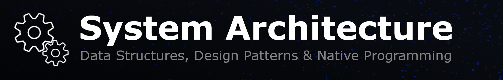

# Unreal Cheat Sheet

## Introduction
Unreal Cheat Sheet is a concise reference for Unreal Engine developers who need quick and practical answers.

🔹 **[General Knowledge](<General Knowledge/README.md>)** – Essential Unreal concepts & architecture decisions.  
&nbsp;&nbsp;&nbsp;&nbsp;▸ **[Data Structures & Algorithms](<General Knowledge/Data Structures and Algorithms.md>)**  
&nbsp;&nbsp;&nbsp;&nbsp;▸ **[Design Patterns](<General Knowledge/Design Patterns.md>)**  
&nbsp;&nbsp;&nbsp;&nbsp;▸ **[Memory Management](<General Knowledge/Memory Management.md>)**  
&nbsp;&nbsp;&nbsp;&nbsp;▸ **[Native Programming](<General Knowledge/Native Programming.md>)**  

🔹 **[Multiplayer & Online](<Multiplayer/README.md>)** –  Concepts behind networking, replication, lag compensation, and server performance for multiplayer games.  
&nbsp;&nbsp;&nbsp;&nbsp;▸ **[Lag Compensation](<Multiplayer/Lag Compensation/README.md>)**  
&nbsp;&nbsp;&nbsp;&nbsp;▸ **[Network Optimization](<Multiplayer/Network Optimization.md>)**  
&nbsp;&nbsp;&nbsp;&nbsp;▸ **[Replication Roles](<Multiplayer/Replication Roles.md>)**  
&nbsp;&nbsp;&nbsp;&nbsp;▸ **[Online Services & Backend](<Online/README.md>)**  
&nbsp;&nbsp;&nbsp;&nbsp;▸ **[Anti-Cheat](<Multiplayer/Anticheat/README.md>)**  
&nbsp;&nbsp;&nbsp;&nbsp;▸ **[Distributed Servers](<Multiplayer/Distributed Servers.md>)**  

🔹 **[Optimization](<Optimization/README.md>)** –  Techniques for improving client performance and reducing server costs in large-scale games.  
&nbsp;&nbsp;&nbsp;&nbsp;▸ **[Profiling](<Optimization/Profiling.md>)**  
&nbsp;&nbsp;&nbsp;&nbsp;▸ **[CPU Optimization](<Optimization/CPUOptimization.md>)**  
&nbsp;&nbsp;&nbsp;&nbsp;▸ **[GPU Optimization](<Optimization/GPUOptimization.md>)**  
&nbsp;&nbsp;&nbsp;&nbsp;▸ **[Memory Optimization](<Optimization/MemoryOptimization.md>)**  
&nbsp;&nbsp;&nbsp;&nbsp;▸ **[Multithreading](<Optimization/Multithreading.md>)**  
&nbsp;&nbsp;&nbsp;&nbsp;▸ **[Slate Optimization](<Optimization/Slate Optimization.md>)**  

<!--🔹 **[Optimization](<Optimization/README.md>)**  
&nbsp;&nbsp;&nbsp;&nbsp;▸ **[Multithreading](<Optimization/Multithreading.md>)**  
&nbsp;&nbsp;&nbsp;&nbsp;▸ **[Slate Optimization](<Optimization/Slate Optimization.md>)**  -->

### Additional Topics  
▸ **[Gameplay](<Gameplay/README.md>)** & **[AI](AI/README.md)**  
▸ **[Editor Tools & Automation](<Editor Tools and Automation/README.md>)**  
▸ **[Level Design](<Level Design/README.md>)**  
▸ **[Art](<Art/README.md>)** & **[Audio](Audio/README.md)**  

## Author
This documentation is written by Samuel Daigle, a Senior Unreal Engine Network and System Engineer with diverse experience in the game industry.

Having spent years solving real-world problems in both AAA and indie games, this cheat sheet has been my personal reference throughout my career. It is everything I wish I had when I started: concise, practical and constantly evolving. Now, I’m sharing it to help you build better games, faster.

This work was made possible thanks to countless uncredited sources, including community discussions, technical articles, YouTube deep dives and AI tools like ChatGPT, all of which have shaped my understanding over the years.

### Contact Info
- **Email**: [samuel_daigle@hotmail.com](mailto:samuel_daigle@hotmail.com)
- **LinkedIn**: [https://www.linkedin.com/in/samueldaigle/](https://www.linkedin.com/in/samueldaigle/)
- **GitHub**: [https://github.com/SamuelDaigle/](https://github.com/SamuelDaigle/)

## License

This documentation is licensed under the [Creative Commons Attribution-NonCommercial 4.0 International License](https://creativecommons.org/licenses/by-nc/4.0/).  
You are free to use, share, and adapt the content for non-commercial purposes, as long as you provide appropriate credit to the author.

For full license details, please refer to the [license text](https://creativecommons.org/licenses/by-nc/4.0/legalcode.txt).

© Samuel Daigle – Licensed under [CC BY-NC 4.0](https://creativecommons.org/licenses/by-nc/4.0/). 